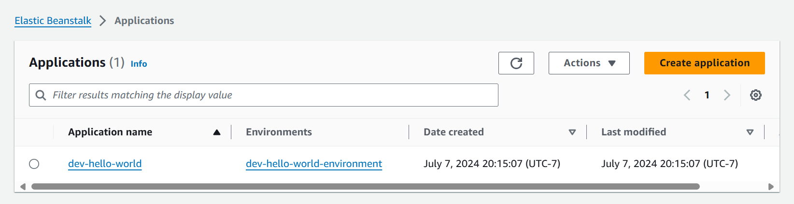
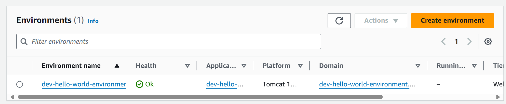

# Continuous Integration Pipeline

This document describes how the continuous integration pipeline works for this application. It describes how to prepare an environment for deployment (E.g. DEV, QA or PROD). 

With the environments in place, this describe and how to build and deploy to that environment, and how the scripts themselves verify the deployment was completed successfully.

# Prepare a deployment environment

In order to deploy the application, An elastic beanstalk environment must be prepared.
This includes an EB application and environment. Additionally, an S3 bucket is requires. Scripts exist to complete this installation. Before running those scripts, install the following pre-requisites:

## Pre-requisites
- python: 3.12.4
- npm: 10.2.4
- node: 18.19.1

After installing those 3 pre-requisites, you can run the `prepare_dev_environment.py` script which will create the environment and application. It uses the CDK.

The environment python script `pipeline/scripts/prepare_dev_environment.py` calls node scripts written in TypeScript, located in the `pipeline/scripts/prepare-environment` directory. As long as node is installed, the scripts will run everything needed.

The scripts will install the following depen
- typescript: 5.1.6
- cdk: 2.2.202

From the command line:
```shell
cd pipeline/scripts
python prepare_dev_environment.py
...
dev-hello-world | 6/6 | 8:19:43 PM | CREATE_COMPLETE      | AWS::CloudFormation::Stack         | dev-hello-world

 ✅  dev-hello-world

✨  Deployment time: 291.61s

Outputs:
dev-hello-world.environmentUrl = awseb-e-u-AWSEBLoa-1SMMYAF23I97P-1447641468.us-west-2.elb.amazonaws.com
Stack ARN:
arn:aws:cloudformation:us-west-2:905418093247:stack/dev-hello-world/3fdc2810-3cd8-11ef-b035-064977033b77

✨  Total time: 293.59s
...
 ✅  dev-hello-world-war-bucket

✨  Deployment time: 13.3s

Outputs:
dev-hello-world-war-bucket.artifactBucketArn = dev-hello-world-war-bucke-devhelloworldbucket2aaee-wwaurlhxofux
Stack ARN:
arn:aws:cloudformation:us-west-2:905418093247:stack/dev-hello-world-war-bucket/944e6550-3be5-11ef-8ecf-02d967948677

✨  Total time: 15.29s
```

Verify the applications and environments exist in aws:



These environments only need be created once, and then can be deployed to over and over again with the pipeline deploy script.

# Configure the deployment script

Take the 2 outputs from the command, the EB domain url and the bucket, and the name of the created environment 'appname-environment'and add them to the `DevConfig.py` python script.
- dev-hello-world.environmentUrl = awseb-e-u-AWSEBLoa-1SMMYAF23I97P-1447641468.us-west-2.elb.amazonaws.com
- dev-hello-world-war-bucket.artifactBucketArn = dev-hello-world-war-bucke-devhelloworldbucket2aaee-wwaurlhxofux
- environmentName = dev-hello-world-environment

E.g. it would look like this:
```python
class DevConfig:
    def __init__(self):
        self.name = "dev"
        # - dev-hello-world.environmentUrl = awseb-e-u-AWSEBLoa-1SMMYAF23I97P-1447641468.us-west-2.elb.amazonaws.com
        # - dev-hello-world-war-bucket.artifactBucketArn = dev-hello-world-war-bucke-devhelloworldbucket2aaee-wwaurlhxofux

        self.artifactory_bucket = "dev-hello-world-war-bucke-devhelloworldbucket2aaee-wwaurlhxofux"
        self.validation_url = "awseb-e-u-AWSEBLoa-1SMMYAF23I97P-1447641468.us-west-2.elb.amazonaws.com/actuator/info"
        self.app_name = "dev-hello-world"
        self.environment_name = "dev-hello-world-environment"
    
    def get_artifact_repository(self) -> ArtifactRepository:
        return ArtifactRepository(self.artifactory_bucket)
```

# Deploy the pipeline

