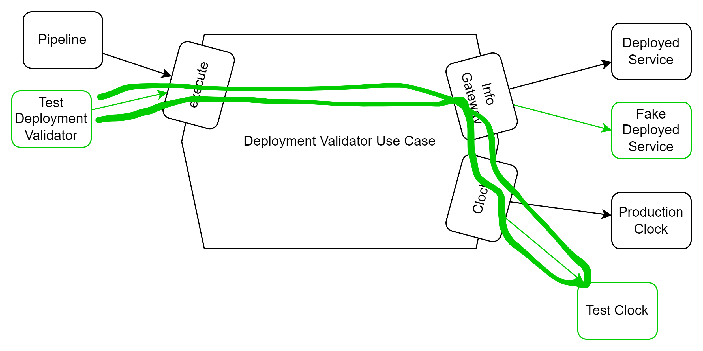

# Continuous Integration using the Runtime Spec

**Make it environmentally aware** You may have realized that so far, this war is very simplistic. It doesn't connect to anything, it isn't environmentally aware. Any application that does anything has a database. It probably has at least one lower environment to test integrations as well, before getting shipped off to prod. Our application is only prints hello world. How would you know if you ever actually deployed a new version correctly? If the new version had an updated bug fix, or domain model, how would you know the fix works to go to production. How would you check your deployment shipped successfully?

So far, there is no way to tell if it shipped correctly. The next level uses the Elastic Beanstalk Runtime Spec **.ebextensions** to make the war environmentally aware and make it so that the deployment can detect and report a deployment failure.

# Smoke check on the version using Spring Actuator

To handle this, we need something that changes with every deploy that we can check. How about the version? Spring has a ready made extension just for this. It's called the actuator. Let's install it!

Add the [actuator as described here](https://docs.spring.io/spring-boot/reference/actuator/enabling.html).

```xml
<dependencies>
	<dependency>
		<groupId>org.springframework.boot</groupId>
		<artifactId>spring-boot-starter-actuator</artifactId>
	</dependency>
</dependencies>
```

[Add the build info information as well as described here](https://howtodoinjava.com/spring-boot/info-endpoint-custom-info/)

After redeploying, you could now see information that changes with every build:

```shell
curl -X GET http://localhost:8080/actuator/info | jq
  % Total    % Received % Xferd  Average Speed   Time    Time     Time  Current
                                 Dload  Upload   Total   Spent    Left  Speed
100   616    0   616    0     0   1330      0 --:--:-- --:--:-- --:--:--  1333
{
...
  "build": {
    "artifact": "corvallis-happenings",
    "name": "corvallis-happenings",
    "time": "2024-06-30T01:38:41.510Z",
    "version": "0.0.1-SNAPSHOT",
    "group": "edu.brent.ik.iac"
  },
}
```

# Check the deployed version automatically

Well that's great that we can see the version of the latest build `"version":"0.0.1-SNAPSHOT"`. We can also see the timestamp `"2024-06-30T01:38:41.510Z"`. This will be unique for every build and will therefore serve our purpose nicely. But we need our deployment to be able to tell though.

Let's write a python script that can hit the endpoint and tell us when deployment has completed and the new deployment has the right version and timestamp in the environment.

From a Clean Architecture / TDD perspective. let's first write component that can parse the info and compare metadata.

In pipeline, create a `tests` folder. Create a python test file called `test_deployment_info_validator.py`

```python
class TestDeploymentInfoValidator(unittest.TestCase):

    def test_should_find_version_give_actuator_info(self):
        info = '''
{
  "build": {
    "artifact": "corvallis-happenings",
    "name": "corvallis-happenings",
    "time": "2024-06-30T04:04:31.441Z",
    "version": "0.0.1-SNAPSHOT",
    "group": "edu.brent.ik.iac"
  }
}
        '''

        expected_time = '2024-06-30T04:04:31.441Z';

        time = deployment_info_validator.getTime(info);
        self.assertEqual(time,expected_time);
        self.assertEqual('foo'.upper(), 'FOO')

```

Then create a file called `deployment_info_validator.py` with this content:

```python
import json

def getTime(info: str):
    parsed_data = json.loads(info)
    return parsed_data["build"]["time"]
```

Make sure the tests pass.

Next we'll pull that from an info gateway, and create a REST Info gateway implementation to pull it. then we'll get our use case class that iterates on the gateway until the deployment succeeds, it times out, or the retry time limit runs out.

# Use Cases

It helps to sketch this out, and narrate the use case. In this case, the use case is part of a larger use case, that of deploying the new version of the application.

## Use Case: Validate Deployment succeeded

**Primary Actors:** Deployment Pipeline

**Secondary Actors:** Deployed Service

### Pre-requisites

1. The pipeline has already finished commands to deploy and now it needs to verify it finished

### Inputs:

1. Environment
   1. Name: (Dev, Production)
   2. Service info metadata URL (The published service URL)
   3. Target deployment build information metadata including:
      1. application version
      2. build date and time.

### Normal Flow:

1. Pipeline creates the build validator with an environment
2. Pipeline initiates the use case with:
   1. Polling interval
   2. Maximum time it will wait for the service to upgrade
3. The use case asks the service it's current build information metadata
4. The service provides it's current build information metadata
5. The use case compares the current build information with the target info in a loop, every polling interval until successful, or the timeout is reached.
   Once the service responds it's updated, the use case responds to the pipeline that deployment completed successfully.

### Alternative Flow:

5A. If the timeout is reached, and the deployed service doesn't every return the updated build info metadata, the use case responds to the pipeline that the deployment failed. It is up to the pipeline to signal any operations facilities of the failure.

### Exceptional Flows:
3E. If the deployed service is unavailable, and ceases to respond to the use case, or responds with error codes, the use case will respond to the pipeline with the failure and the error code.

## Architecture

Because we want to test the retry logic, without a connection to the deployed service, we create a deployed service gateway and a clock interface as well. For testing, these items can be shaped to do whatever we want, and abstract away the integration details.

## Unit Tests
A use case test that tests how the Deployment Validator works, with those fakes. It's a test that hits all the boundary cases we can think of and runs in about .3 seconds, runs reliably and deterministically because it's dependencies are owned by it.

## Integration Tests
We need some integration tests to validate the implementation of the Deployed Service.
