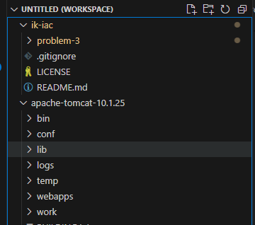
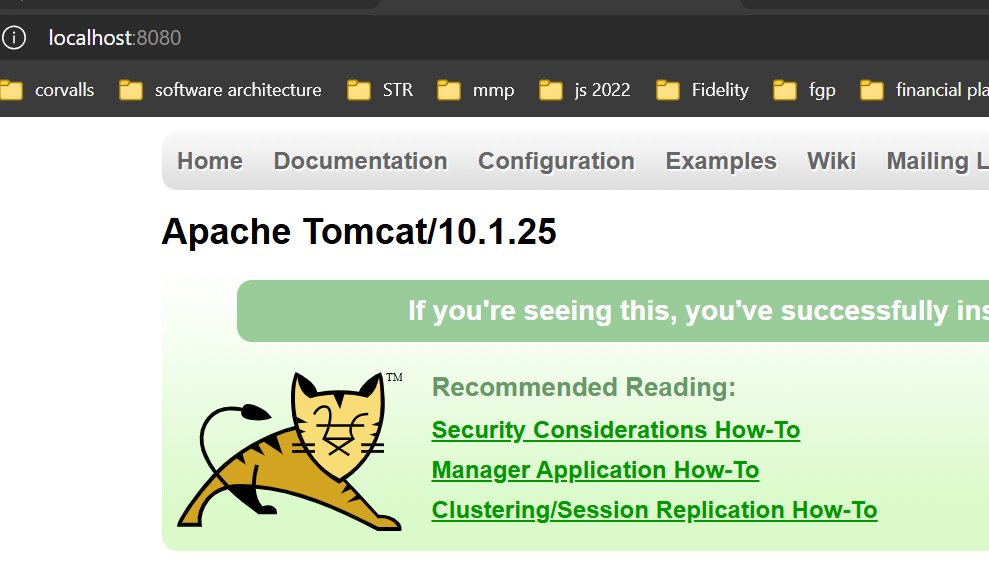
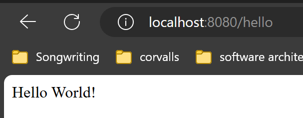
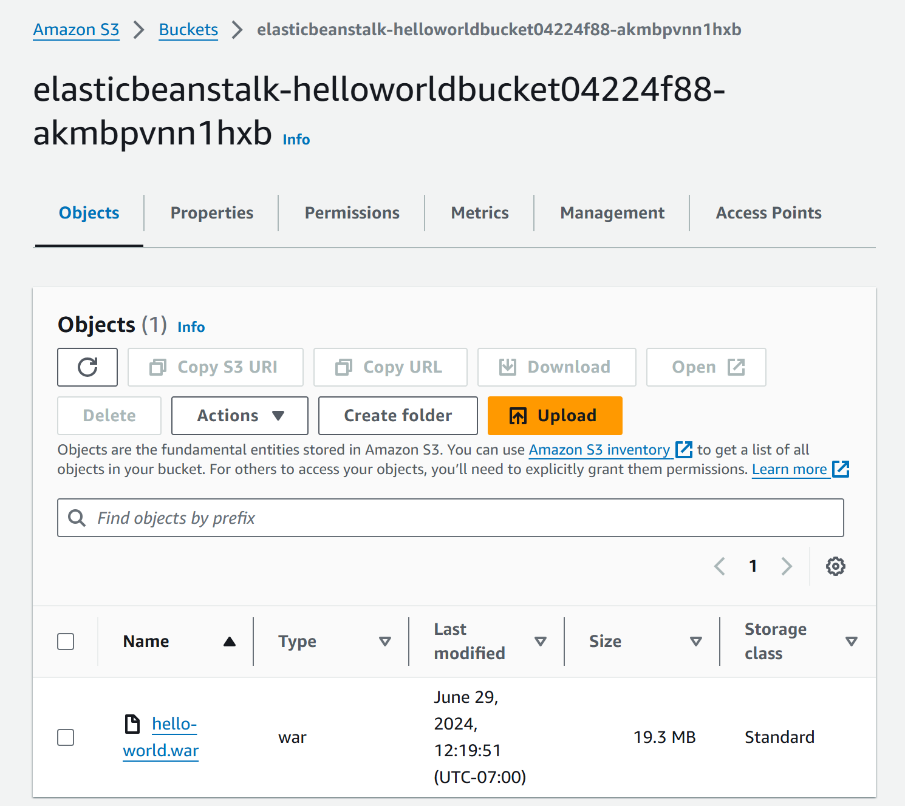
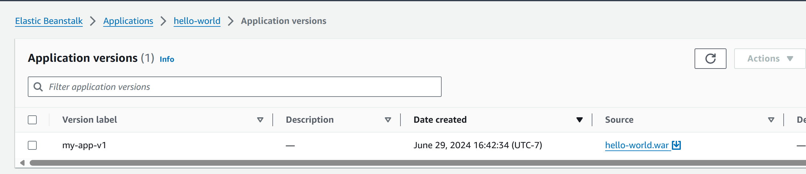
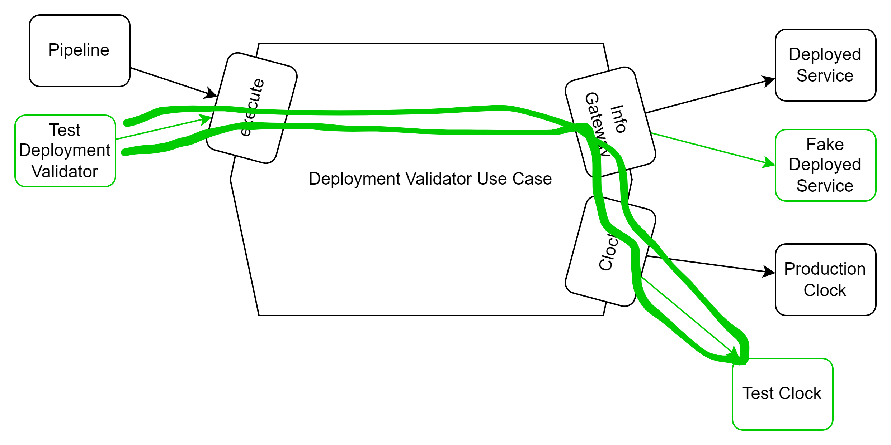

# Application Details

This read me details. how the application is built and how it is structured and how to deploy the application to a local Tomcat and to deploy the application to elastic beanstalk. Full details for continuous integration can be found [here](ci.md).

# Initialization

I'll start with a simple spring boot app that just says Hello World to make this really easy. I used the spring initializer.

This starts with just a basic spring boot app, without a rest controller or anything:

```java
@SpringBootApplication
public class CorvallisHappeningsApplication {

	public static void main(String[] args) {
		SpringApplication.run(CorvallisHappeningsApplication.class, args);
	}

}
```

```java
public class ServletInitializer extends SpringBootServletInitializer {

	@Override
	protected SpringApplicationBuilder configure(SpringApplicationBuilder application) {
		return application.sources(CorvallisHappeningsApplication.class);
	}

}
```

running the command `mvn springboot:run` results in a server that is listening, but no resources.

```shell
2024-06-27T17:26:57.428-07:00  INFO 10540 --- [corvallis-happenings] [  restartedMain] o.s.b.w.embedded.tomcat.TomcatWebServer  : Tomcat initialized with port 8080 (http)
```

```shell
curl http://localhost:8080
curl : The remote server returned an error: (404) Not Found.
```

# Add a rest controller for hello world

```java
@RestController
public class HelloWorldController {
    @GetMapping("/hello")
    public String sayHello() {
        return "Hello World!";
    }
}
```

**Note:** Live upload made it so I don't have to restart!

```shell
2024-06-27T17:36:43.883-07:00  INFO 10540 --- [corvallis-happenings] [nio-8080-exec-1] o.s.web.servlet.DispatcherServlet        : Completed initialization in 0 ms
```

```shell
curl http://localhost:8080/hello


StatusCode        : 200
StatusDescription :
Content           : Hello World!
RawContent        : HTTP/1.1 200
                    Keep-Alive: timeout=60
                    Connection: keep-alive
                    Content-Length: 12
                    Content-Type: text/plain;charset=UTF-8
                    Date: Fri, 28 Jun 2024 00:36:43 GMT

                    Hello World!
Forms             : {}
Headers           : {[Keep-Alive, timeout=60], [Connection, keep-alive], [Content-Length,
                    12], [Content-Type, text/plain;charset=UTF-8]...}
Images            : {}
InputFields       : {}
Links             : {}
ParsedHtml        : mshtml.HTMLDocumentClass
RawContentLength  : 12
```

Commit

# Make a target for AWS ElasticBeanstalk

Make the target for elastic beanstalk by creating a war and deploying to Tomcat locally.

## install tomcat

[Tomcat install](https://tomcat.apache.org/)

I installed mine here: `~\work\software\apache-tomcat-10.1.25`

I like to add it temporarily to my visual studio code workspace:



### Configure Tomcat Users:

Let’s make these changes in `$CATALINA_HOME\conf\tomcat-users:`

```xml
<role rolename="manager-gui"/>
<role rolename="manager-script"/>
<user username="admin" password="password" roles="manager-gui, manager-script"/>
```

### set directory permissions

```shell
chmod 755 webapps
```

### test startup

from $CATALINA_HOME\bin

```shell
.\startup.bat
...
27-Jun-2024 17:59:18.705 INFO [main] org.apache.catalina.startup.Catalina.start Server startup in [1355] milliseconds
```

```shell
curl http://localhost:8080
...
```



# Deploy from Maven

1. Configure Tomcat as a server in Maven's settings.xml file.

```xml
<settings xmlns="http://maven.apache.org/SETTINGS/1.0.0"
          xmlns:xsi="http://www.w3.org/2001/XMLSchema-instance"
          xsi:schemaLocation="http://maven.apache.org/SETTINGS/1.0.0 http://maven.apache.org/xsd/settings-1.0.0.xsd">

    <!-- Local repository path -->
    <localRepository>${user.home}/.m2/repository</localRepository>

    <!-- Other configurations can be added here -->
    <server>
        <id>TomcatServer</id>
        <username>admin</username>
        <password>password</password>
    </server>
</settings>

```

1. Add the plugin to your pom.xml

```xml
<build>
  <plugins>
    <plugin>
        <groupId>org.apache.tomcat.maven</groupId>
        <artifactId>tomcat7-maven-plugin</artifactId>
        <version>2.2</version>
        <configuration>
            <url>http://localhost:8080/manager/text</url>
            <username>admin</username>
            <password>password</password>
            <server>TomcatServer</server>
            <path>/myapp</path>
        </configuration>
    </plugin>
  </plugins>
</build>
```

**Note:** Due to reasons I don't understand, maven wasn't picking up the
username and password set on the **TomcatServer** set in **~/.m2/settings.xml** so I set it in the pom, and then it worked according to [this SO article.](https://stackoverflow.com/questions/32230962/mvn-tomcat7deploy-cannot-invoke-tomcat-manager-broken-pipe)

# Test it out

```shell
mvn tomcat7:deploy
...
[INFO] Deploying war to http://localhost:8080/
Uploading: http://localhost:8080/manager/text/deploy?path=%2F&update=true
Uploaded: http://localhost:8080/manager/text/deploy?path=%2F&update=true (19800 KB at 29031.5 KB/sec)
```



# Add the Elastic Beanstalk Deploy with CDK

Copy the elastic beanstalk CDK environment files from the [cdk examples](https://github.com/aws-samples/aws-cdk-examples/tree/main/typescript/elasticbeanstalk/elasticbeanstalk-environment)
**pipeline/elasticbeanstalk-environment**/cdk.json...

update the cdk.json to a tomcat version 10

```json
        "platform": "arn:aws:elasticbeanstalk:us-west-2::platform/Tomcat 10 with Corretto 17 running on 64bit Amazon Linux 2023:5.1.8"
```

run `npm install`

this is typscript, so run `npm run build`

install cdk `npm install --global cdk`

run `cdk synth`

```yaml
Resources:
  Application:
    Type: AWS::ElasticBeanstalk::Application
    Properties:
      ApplicationName: MyApp
    Metadata:
      aws:cdk:path: ElasticBeanstalk/Application
...
                  - "3"
                  - "4"
                  - "5"
                - Ref: BootstrapVersion
        AssertDescription: CDK bootstrap stack version 6 required. Please run 'cdk bootstrap' with a recent version of the CDK CLI.
```

# Connect to the aws environment

prepare cdk to connect to the environment with the **ecsadmin** user. e.g. `export AWS_DEFAULT_PROFILE=ecsadmin-8`

gather or create your **aws_access_key_id** and **aws_secret_access_key** from your account and run `aws configure`

set your region. Example: **~/.aws/config**

```
[default]
region = us-west-2
output = json
```

# bootstrap the environment

`cdk bootstrap`
If that looks OK, run `cdk deploy` to create the application and environment.

While it's deploying, open the console and check it out!

After a while, you may see success!

```
 ✅  ElasticBeanstalk

✨  Deployment time: 293.9s

Stack ARN:
arn:aws:cloudformation:us-west-2:905418093247:stack/ElasticBeanstalk/ebd6ace0-35a7-11ef-a271-02082a16ab5f

✨  Total time: 296.48s
```

Take note of the deployed public url in your stack. E.g. test-env.eba-9tjmnwpj.us-west-2.elasticbeanstalk.com

# Manually deploy the application

This is just the Application and the Environment. Now we need to upload and deploy the 'corvallis-happenings' application.

To test our war first, manually select the deployed environment and select 'Upload and deploy', and give it your war.

If you have bad luck like mine and nothing happens, check **Troubleshooting below**. If however, you did better and used all the same versions of java for building and running your application, you'll see success like below here:

```shell
curl -X GET "http://test-env.eba-9tjmnwpj.us-west-2.elasticbeanstalk.com/hello"
Hello World!
```

# Add a bucket for staging for deployment through the cdk

Add a bucket to `index.ts` for uploading and deploying the web application.

```TypeScript
    new s3.Bucket(this, `${appName}Bucket`,{
      removalPolicy: cdk.RemovalPolicy.DESTROY,
      publicReadAccess: true,
      blockPublicAccess: {
        blockPublicPolicy: false,
        blockPublicAcls: false,
        ignorePublicAcls: false,
        restrictPublicBuckets: false,
      },
    });
```

# Automate the deployment

First, we will choose to install python to use boto. The CDK doesn't
work well for uploading the war to the s3 bucket.

## Prerequisites

- Python 3 -- install from the microsoft store
- boto3 -- run `pip install boto3`

## Create the war deployment script.

this is the first version of the script that will hard code all the values for the environment and artifact versions. Eventually we will parameterize the script so that it can be run for different environments and different version of the application.

```python
import boto3

# Initialize the S3 client
s3 = boto3.client('s3')

# Create a new S3 bucket
bucket_name = 'dev-hello-world-war-bucke-devhelloworldbucket2aaee-wwaurlhxofux'
print(f"WAR file uploading to S3 bucket: {bucket_name}")

# Upload your WAR file to the bucket
war_file_path = '../../corvallis-happenings/target/corvallis-happenings-0.0.1-SNAPSHOT.war'
s3.upload_file(war_file_path, bucket_name, 'hello-world.war')

print(f"WAR file uploaded to S3 bucket: {bucket_name}")
```

Try it out. Did it upload to your bucket?



# Deploy the war to the environment

Make the deployment script

**deploy_to_eb.py**

```python
import boto3

def deploy_to_eb(bucket_name, object_key, environment_name, application_name):
    try:
        # Initialize the Elastic Beanstalk client
        eb_client = boto3.client('elasticbeanstalk')

        # Create a new application version
        response = eb_client.create_application_version(
            ApplicationName=application_name,
            VersionLabel='my-app-v1',  # Replace with your desired version label
            SourceBundle={
                'S3Bucket': bucket_name,
                'S3Key': object_key
            }
        )

        # Deploy the new version to the environment
        eb_client.update_environment(
            EnvironmentName=environment_name,
            VersionLabel='my-app-v1'  # Same version label as above
        )

        print(f"New version deployed to {environment_name}")
    except Exception as e:
        print(f"Error deploying: {str(e)}")

if __name__ == "__main__":
    bucket_name = 'dev-hello-world-war-bucke-devhelloworldbucket2aaee-wwaurlhxofux'
    object_key = 'hello-world.war'
    environment_name = 'hello-worldEnvironment'
    application_name = 'hello-world'

    deploy_to_eb(bucket_name, object_key, environment_name, application_name)
```

**run it**

```shell
python deploy_to_eb.py
New version deployed to hello-worldEnvironment
```

**Validate** in AWS


**Validate with curl**

```shell
curl -X GET http://hello-worldenvironment.eba-muraeydq.us-west-2.elasticbeanstalk.com/hello
Hello World!
```

Next steps are to created a Continuous Integration pipeline. See [here](ci.md) for the instructions for using the CI/CD pipeline.

So far, there is no way to tell if it shipped correctly. The next level uses the Elastic Beanstalk Runtime Spec **.ebextensions** to make the war environmentally aware and make it so that the deployment can detect and report a deployment failure.

# Smoke check on the version using Spring Actuator

To handle this, we need something that changes with every deploy that we can check. How about the version? Spring has a ready made extension just for this. It's called the actuator. Let's install it!

Add the [actuator as described here](https://docs.spring.io/spring-boot/reference/actuator/enabling.html).

```xml
<dependencies>
	<dependency>
		<groupId>org.springframework.boot</groupId>
		<artifactId>spring-boot-starter-actuator</artifactId>
	</dependency>
</dependencies>
```

[Add the build info information as well as described here](https://howtodoinjava.com/spring-boot/info-endpoint-custom-info/)

After redeploying, you could now see information that changes with every build:

```shell
curl -X GET http://localhost:8080/actuator/info | jq
  % Total    % Received % Xferd  Average Speed   Time    Time     Time  Current
                                 Dload  Upload   Total   Spent    Left  Speed
100   616    0   616    0     0   1330      0 --:--:-- --:--:-- --:--:--  1333
{
...
  "build": {
    "artifact": "corvallis-happenings",
    "name": "corvallis-happenings",
    "time": "2024-06-30T01:38:41.510Z",
    "version": "0.0.1-SNAPSHOT",
    "group": "edu.brent.ik.iac"
  },
}
```

# Check the deployed version automatically

Well that's great that we can see the version of the latest build `"version":"0.0.1-SNAPSHOT"`. We can also see the timestamp `"2024-06-30T01:38:41.510Z"`. This will be unique for every build and will therefore serve our purpose nicely. But we need our deployment to be able to tell though.

Let's write a python script that can hit the endpoint and tell us when deployment has completed and the new deployment has the right version and timestamp in the environment.

From a Clean Architecture / TDD perspective. let's first write component that can parse the info and compare metadata.

In pipeline, create a `tests` folder. Create a python test file called `test_deployment_info_validator.py`

```python
class TestDeploymentInfoValidator(unittest.TestCase):

    def test_should_find_version_give_actuator_info(self):
        info = '''
{
  "build": {
    "artifact": "corvallis-happenings",
    "name": "corvallis-happenings",
    "time": "2024-06-30T04:04:31.441Z",
    "version": "0.0.1-SNAPSHOT",
    "group": "edu.brent.ik.iac"
  }
}
        '''

        expected_time = '2024-06-30T04:04:31.441Z';

        time = deployment_info_validator.getTime(info);
        self.assertEqual(time,expected_time);
        self.assertEqual('foo'.upper(), 'FOO')

```

Then create a file called `deployment_info_validator.py` with this content:

```python
import json

def getTime(info: str):
    parsed_data = json.loads(info)
    return parsed_data["build"]["time"]
```

Make sure the tests pass.

Next we'll pull that from an info gateway, and create a REST Info gateway implementation to pull it. then we'll get our use case class that iterates on the gateway until the deployment succeeds, it times out, or the retry time limit runs out.

# Use Cases

It helps to sketch this out, and narrate the use case. In this case, the use case is part of a larger use case, that of deploying the new version of the application.

## Use Case: Validate Deployment succeeded

**Primary Actors:** Deployment Pipeline

**Secondary Actors:** Deployed Service

### Pre-requisites

1. The pipeline has already finished commands to deploy and now it needs to verify it finished

### Inputs:

1. Environment
   1. Name: (Dev, Production)
   2. Service info metadata URL (The published service URL)
   3. Target deployment build information metadata including:
      1. application version
      2. build date and time.

### Normal Flow:

1. Pipeline creates the build validator with an environment
2. Pipeline initiates the use case with:
   1. Polling interval
   2. Maximum time it will wait for the service to upgrade
3. The use case asks the service it's current build information metadata
4. The service provides it's current build information metadata
5. The use case compares the current build information with the target info in a loop, every polling interval until successful, or the timeout is reached.
   Once the service responds it's updated, the use case responds to the pipeline that deployment completed successfully.

### Alternative Flow:

5A. If the timeout is reached, and the deployed service doesn't every return the updated build info metadata, the use case responds to the pipeline that the deployment failed. It is up to the pipeline to signal any operations facilities of the failure.

### Exceptional Flows:

3E. If the deployed service is unavailable, and ceases to respond to the use case, or responds with error codes, the use case will respond to the pipeline with the failure and the error code.

## Architecture


Because we want to test the retry logic, without a connection to the deployed service, we create a deployed service gateway and a clock interface as well. For testing, these items can be shaped to do whatever we want, and abstract away the integration details.

## Unit Tests

A use case test that tests how the Deployment Validator works, with those fakes. It's a test that hits all the boundary cases we can think of and runs in about .3 seconds, runs reliably and deterministically because it's dependencies are owned by it.

## Integration Tests

We need some integration tests to validate the implementation of the Deployed Service.

install flask `pip install flask`. This will allow us to have a little server acting like our deployed service.

create a file `test_deployed_service_gateway_integration.py`

create a file called `fake_deployed_service.py`

copy the following to try out your mock server:

```python
from flask import Flask, json

companies = [
    {"id": 1, "name": "Company One"},
    {"id": 2, "name": "Company Two"}
]

app = Flask(__name__)

@app.route('/companies', methods=['GET'])
def get_companies():
    return json.dumps(companies)

if __name__ == '__main__':
    app.run()
```

run it from the terminal:

```shell
& C:/Users/bcfis/AppData/Local/Microsoft/WindowsApps/python3.12.exe c:/Users/bcfis/work/ik/cloud-iac/ik-iac/problem-3/pipeline/tests/fake_deployed_service.py
 * Serving Flask app 'fake_deployed_service'
 * Debug mode: off
WARNING: This is a development server. Do not use it in a production deployment. Use a production WSGI server instead.
 * Running on http://127.0.0.1:5000
Press CTRL+C to quit
```

hit it with curl to try it out.

```shell
curl -X GET http://localhost:5000/companies
[{"id": 1, "name": "Company One"}, {"id": 2, "name": "Company Two"}]
```

try a test that starts it and stops it.

july 1, 11:03 PM: having some trouble with current working directory to
build locally and push. seems the CWD in the process
has a difficult time with a directory created from the CWD, with extensions added on.
