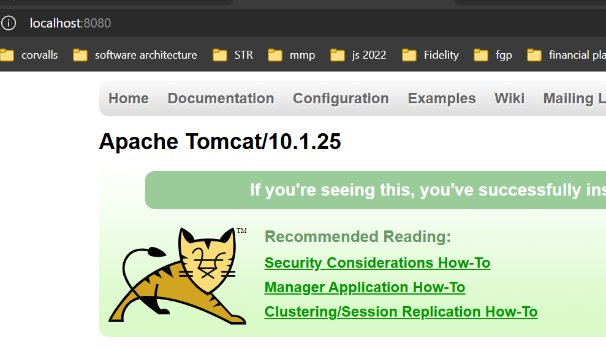
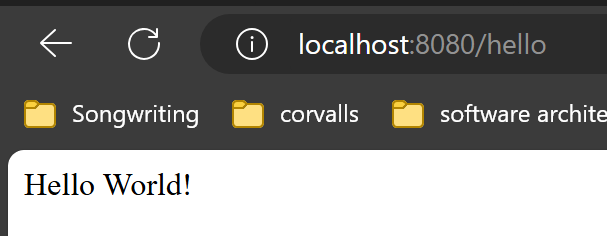

# Problem 3

Select an application written in a language that is supported by an application runtime like Google App Engine Standard Environment or AWS Elastic Beanstalk.
Alternatively, create a simple application with a health endpoint.
If the service requires a database or other external connection, set up those resources using whichever tool you prefer.
Create a spec file for the application runtime.
Using the cloud provider’s console or CLI, deploy the application using your spec file.
Verify the deployment and that the application is running as expected.

Deliverables
Create an application runtime spec file for the service you choose.
Create a document containing documentation for this process.
Include a step-by-step process for deploying future versions.
Include a section explaining how to verify the service is running as expected.
If you run into issues, add an FAQ section to help avoid them in the future.

# Solution

I'll start with a simple spring boot app that just says Hello World to make this really easy. I used the spring initializer.

# Initialization

This starts with just a basic spring boot app, without a rest controller or anything:

```java
@SpringBootApplication
public class CorvallisHappeningsApplication {

	public static void main(String[] args) {
		SpringApplication.run(CorvallisHappeningsApplication.class, args);
	}

}
```

```java
public class ServletInitializer extends SpringBootServletInitializer {

	@Override
	protected SpringApplicationBuilder configure(SpringApplicationBuilder application) {
		return application.sources(CorvallisHappeningsApplication.class);
	}

}
```

running the command `mvn springboot:run` results in a server that is listening, but no resources.

```shell
2024-06-27T17:26:57.428-07:00  INFO 10540 --- [corvallis-happenings] [  restartedMain] o.s.b.w.embedded.tomcat.TomcatWebServer  : Tomcat initialized with port 8080 (http)
```

```shell
curl http://localhost:8080
curl : The remote server returned an error: (404) Not Found.
```

# Add a rest controller for hello world
```java
@RestController
public class HelloWorldController {
    @GetMapping("/hello")
    public String sayHello() {
        return "Hello World!";
    }
}
```

**Note:** Live upload made it so I don't have to restart!

```shell
2024-06-27T17:36:43.883-07:00  INFO 10540 --- [corvallis-happenings] [nio-8080-exec-1] o.s.web.servlet.DispatcherServlet        : Completed initialization in 0 ms
```

```shell
curl http://localhost:8080/hello


StatusCode        : 200
StatusDescription :
Content           : Hello World!
RawContent        : HTTP/1.1 200
                    Keep-Alive: timeout=60
                    Connection: keep-alive
                    Content-Length: 12
                    Content-Type: text/plain;charset=UTF-8
                    Date: Fri, 28 Jun 2024 00:36:43 GMT

                    Hello World!
Forms             : {}
Headers           : {[Keep-Alive, timeout=60], [Connection, keep-alive], [Content-Length,     
                    12], [Content-Type, text/plain;charset=UTF-8]...}
Images            : {}
InputFields       : {}
Links             : {}
ParsedHtml        : mshtml.HTMLDocumentClass
RawContentLength  : 12
```

Commit

# Make a target for AWS ElasticBeanstalk
Make the target for elastic beanstalk by creating a war and deploying to Tomcat locally.

## install tomcat

[Tomcat install](https://tomcat.apache.org/)

I installed mine here: `~\work\software\apache-tomcat-10.1.25`

I like to add it temporarily to my visual studio code workspace:


### Configure Tomcat Users:

Let’s make these changes in `$CATALINA_HOME\conf\tomcat-users:`


```xml
<role rolename="manager-gui"/>
<role rolename="manager-script"/>
<user username="admin" password="password" roles="manager-gui, manager-script"/>
```

### set directory permissions

```shell
chmod 755 webapps
```

### test startup

from $CATALINA_HOME\bin
```shell
.\startup.bat 
...
27-Jun-2024 17:59:18.705 INFO [main] org.apache.catalina.startup.Catalina.start Server startup in [1355] milliseconds
```

```shell
curl http://localhost:8080
...
```


# Deploy from Maven

1. Configure Tomcat as a server in Maven's settings.xml file.

```xml
<settings xmlns="http://maven.apache.org/SETTINGS/1.0.0"
          xmlns:xsi="http://www.w3.org/2001/XMLSchema-instance"
          xsi:schemaLocation="http://maven.apache.org/SETTINGS/1.0.0 http://maven.apache.org/xsd/settings-1.0.0.xsd">

    <!-- Local repository path -->
    <localRepository>${user.home}/.m2/repository</localRepository>

    <!-- Other configurations can be added here -->
    <server>
        <id>TomcatServer</id>
        <username>admin</username>
        <password>password</password>
    </server>
</settings>

```

1. Add the plugin to your pom.xml

```xml
<build>
  <plugins>
    <plugin>
        <groupId>org.apache.tomcat.maven</groupId>
        <artifactId>tomcat7-maven-plugin</artifactId>
        <version>2.2</version>
        <configuration>
            <url>http://localhost:8080/manager/text</url>
            <username>admin</username>
            <password>password</password>
            <server>TomcatServer</server>
            <path>/myapp</path>
        </configuration>
    </plugin>
  </plugins>
</build>
```

**Note:** Due to reasons I don't understand, maven wasn't picking up the 
username and password set on the **TomcatServer** set in **~/.m2/settings.xml** so I set it in the pom, and then it worked according to [this SO article.](https://stackoverflow.com/questions/32230962/mvn-tomcat7deploy-cannot-invoke-tomcat-manager-broken-pipe)

# Test it out

```shell
mvn tomcat7:deploy
...
[INFO] Deploying war to http://localhost:8080/  
Uploading: http://localhost:8080/manager/text/deploy?path=%2F&update=true
Uploaded: http://localhost:8080/manager/text/deploy?path=%2F&update=true (19800 KB at 29031.5 KB/sec)
```



# Add the Elastic Beanstalk Deploy with CDK

Copy the elastic beanstalk CDK environment files from the cdk examples
**pipeline/elasticbeanstalk-environment**/cdk.json...

update the cdk.json to a tomcat version 10

```json
        "platform": "arn:aws:elasticbeanstalk:us-west-2::platform/Tomcat 10 with Corretto 17 running on 64bit Amazon Linux 2023:5.1.8"
```

run `npm install`

this is typscript, so run `npm run build`

install cdk `npm install --global cdk`

run `cdk synth`

```yaml
Resources:
  Application:
    Type: AWS::ElasticBeanstalk::Application
    Properties:
      ApplicationName: MyApp
    Metadata:
      aws:cdk:path: ElasticBeanstalk/Application
...
                  - "3"
                  - "4"
                  - "5"
                - Ref: BootstrapVersion
        AssertDescription: CDK bootstrap stack version 6 required. Please run 'cdk bootstrap' with a recent version of the CDK CLI.
```

# Connect to the aws environment
prepare cdk to connect to the environment with the **ecsadmin** user. e.g. `export AWS_DEFAULT_PROFILE=ecsadmin-8`

gather or create your **aws_access_key_id** and **aws_secret_access_key** from your account and run `aws configure`

set your region. Example: **~/.aws/config**
```
[default]
region = us-west-2
output = json
```


# bootstrap the environment
`cdk bootstrap`
If that looks OK, run `cdk deploy` to create the application and environment.

While it's deploying, open the console and check it out!

After a while, you may see success!

```
 ✅  ElasticBeanstalk

✨  Deployment time: 293.9s

Stack ARN:
arn:aws:cloudformation:us-west-2:905418093247:stack/ElasticBeanstalk/ebd6ace0-35a7-11ef-a271-02082a16ab5f

✨  Total time: 296.48s
```
