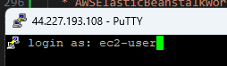

# Problem 3

Select an application written in a language that is supported by an application runtime like Google App Engine Standard Environment or AWS Elastic Beanstalk.
Alternatively, create a simple application with a health endpoint.
If the service requires a database or other external connection, set up those resources using whichever tool you prefer.
Create a spec file for the application runtime.
Using the cloud provider’s console or CLI, deploy the application using your spec file.
Verify the deployment and that the application is running as expected.

Deliverables
Create an application runtime spec file for the service you choose.
Create a document containing documentation for this process.
Include a step-by-step process for deploying future versions.
Include a section explaining how to verify the service is running as expected.
If you run into issues, add an FAQ section to help avoid them in the future.

# Solution

I'll start with a simple spring boot app that just says Hello World to make this really easy. I used the spring initializer.

# Initialization

This starts with just a basic spring boot app, without a rest controller or anything:

```java
@SpringBootApplication
public class CorvallisHappeningsApplication {

	public static void main(String[] args) {
		SpringApplication.run(CorvallisHappeningsApplication.class, args);
	}

}
```

```java
public class ServletInitializer extends SpringBootServletInitializer {

	@Override
	protected SpringApplicationBuilder configure(SpringApplicationBuilder application) {
		return application.sources(CorvallisHappeningsApplication.class);
	}

}
```

running the command `mvn springboot:run` results in a server that is listening, but no resources.

```shell
2024-06-27T17:26:57.428-07:00  INFO 10540 --- [corvallis-happenings] [  restartedMain] o.s.b.w.embedded.tomcat.TomcatWebServer  : Tomcat initialized with port 8080 (http)
```

```shell
curl http://localhost:8080
curl : The remote server returned an error: (404) Not Found.
```

# Add a rest controller for hello world
```java
@RestController
public class HelloWorldController {
    @GetMapping("/hello")
    public String sayHello() {
        return "Hello World!";
    }
}
```

**Note:** Live upload made it so I don't have to restart!

```shell
2024-06-27T17:36:43.883-07:00  INFO 10540 --- [corvallis-happenings] [nio-8080-exec-1] o.s.web.servlet.DispatcherServlet        : Completed initialization in 0 ms
```

```shell
curl http://localhost:8080/hello


StatusCode        : 200
StatusDescription :
Content           : Hello World!
RawContent        : HTTP/1.1 200
                    Keep-Alive: timeout=60
                    Connection: keep-alive
                    Content-Length: 12
                    Content-Type: text/plain;charset=UTF-8
                    Date: Fri, 28 Jun 2024 00:36:43 GMT

                    Hello World!
Forms             : {}
Headers           : {[Keep-Alive, timeout=60], [Connection, keep-alive], [Content-Length,     
                    12], [Content-Type, text/plain;charset=UTF-8]...}
Images            : {}
InputFields       : {}
Links             : {}
ParsedHtml        : mshtml.HTMLDocumentClass
RawContentLength  : 12
```

Commit

# Make a target for AWS ElasticBeanstalk
Make the target for elastic beanstalk by creating a war and deploying to Tomcat locally.

## install tomcat

[Tomcat install](https://tomcat.apache.org/)

I installed mine here: `~\work\software\apache-tomcat-10.1.25`

I like to add it temporarily to my visual studio code workspace:


### Configure Tomcat Users:

Let’s make these changes in `$CATALINA_HOME\conf\tomcat-users:`


```xml
<role rolename="manager-gui"/>
<role rolename="manager-script"/>
<user username="admin" password="password" roles="manager-gui, manager-script"/>
```

### set directory permissions

```shell
chmod 755 webapps
```

### test startup

from $CATALINA_HOME\bin
```shell
.\startup.bat 
...
27-Jun-2024 17:59:18.705 INFO [main] org.apache.catalina.startup.Catalina.start Server startup in [1355] milliseconds
```

```shell
curl http://localhost:8080
...
```


# Deploy from Maven

1. Configure Tomcat as a server in Maven's settings.xml file.

```xml
<settings xmlns="http://maven.apache.org/SETTINGS/1.0.0"
          xmlns:xsi="http://www.w3.org/2001/XMLSchema-instance"
          xsi:schemaLocation="http://maven.apache.org/SETTINGS/1.0.0 http://maven.apache.org/xsd/settings-1.0.0.xsd">

    <!-- Local repository path -->
    <localRepository>${user.home}/.m2/repository</localRepository>

    <!-- Other configurations can be added here -->
    <server>
        <id>TomcatServer</id>
        <username>admin</username>
        <password>password</password>
    </server>
</settings>

```

1. Add the plugin to your pom.xml

```xml
<build>
  <plugins>
    <plugin>
        <groupId>org.apache.tomcat.maven</groupId>
        <artifactId>tomcat7-maven-plugin</artifactId>
        <version>2.2</version>
        <configuration>
            <url>http://localhost:8080/manager/text</url>
            <username>admin</username>
            <password>password</password>
            <server>TomcatServer</server>
            <path>/myapp</path>
        </configuration>
    </plugin>
  </plugins>
</build>
```

**Note:** Due to reasons I don't understand, maven wasn't picking up the 
username and password set on the **TomcatServer** set in **~/.m2/settings.xml** so I set it in the pom, and then it worked according to [this SO article.](https://stackoverflow.com/questions/32230962/mvn-tomcat7deploy-cannot-invoke-tomcat-manager-broken-pipe)

# Test it out

```shell
mvn tomcat7:deploy
...
[INFO] Deploying war to http://localhost:8080/  
Uploading: http://localhost:8080/manager/text/deploy?path=%2F&update=true
Uploaded: http://localhost:8080/manager/text/deploy?path=%2F&update=true (19800 KB at 29031.5 KB/sec)
```


# Add the Elastic Beanstalk Deploy with CDK

Copy the elastic beanstalk CDK environment files from the cdk examples
**pipeline/elasticbeanstalk-environment**/cdk.json...

update the cdk.json to a tomcat version 10

```json
        "platform": "arn:aws:elasticbeanstalk:us-west-2::platform/Tomcat 10 with Corretto 17 running on 64bit Amazon Linux 2023:5.1.8"
```

run `npm install`

this is typscript, so run `npm run build`

install cdk `npm install --global cdk`

run `cdk synth`

```yaml
Resources:
  Application:
    Type: AWS::ElasticBeanstalk::Application
    Properties:
      ApplicationName: MyApp
    Metadata:
      aws:cdk:path: ElasticBeanstalk/Application
...
                  - "3"
                  - "4"
                  - "5"
                - Ref: BootstrapVersion
        AssertDescription: CDK bootstrap stack version 6 required. Please run 'cdk bootstrap' with a recent version of the CDK CLI.
```

# Connect to the aws environment
prepare cdk to connect to the environment with the **ecsadmin** user. e.g. `export AWS_DEFAULT_PROFILE=ecsadmin-8`

gather or create your **aws_access_key_id** and **aws_secret_access_key** from your account and run `aws configure`

set your region. Example: **~/.aws/config**
```
[default]
region = us-west-2
output = json
```


# bootstrap the environment
`cdk bootstrap`
If that looks OK, run `cdk deploy` to create the application and environment.

While it's deploying, open the console and check it out!

After a while, you may see success!

```
 ✅  ElasticBeanstalk

✨  Deployment time: 293.9s

Stack ARN:
arn:aws:cloudformation:us-west-2:905418093247:stack/ElasticBeanstalk/ebd6ace0-35a7-11ef-a271-02082a16ab5f

✨  Total time: 296.48s
```

# Deploy the application

This is just the Application and the Environment. Now we need to upload and deploy the 'corvallis-happenings' application.

To test our war first, manually select the deployed environment and select 'Upload and deploy', and git it your war.

If you have bad luck like mine and nothing happens, check **Troubleshooting below**. If however, you did better and used all the same versions of java for building and running your application, you'll see success like below here:

```shell
curl -X GET "http://test-env.eba-9tjmnwpj.us-west-2.elasticbeanstalk.com/hello"
Hello World!
```


# Troubleshooting

If it won't start, attempt to create the stack manually.

## Create the ElasticBeanstalk Role and Instance Profile

Create an IAM role, similar to the one in the cdk index.ts file. E.g.
* Name: AWSElasticBeanstalkWorkerTier
* ServicePrincipal: 'ec2.amazonaws.com'
* Permissions:
  * AWSElasticBeanstalkWebTier
  * AWSElasticBeanstalkMulticontainerDocker
  * AWSElasticBeanstalkWorkerTier

**Notice the instance profile**


Creating the role creates an instance profile with an ARN that can be used for creating the ElasticBeanstalk environment.

**ARN:** arn:aws:iam::905418093247:instance-profile/HelloWorldElasticBeanstalkControllerRole

## Configure service access
to help troubleshoot, you'll need an EC2 key pair and an EC2 instance profile
unrelated to any cdk generated instance profile to ensure you can manage
their lifecycles separately. I.e. you don't want the dependency or else you won't be able to delete the stack without finding all the references first.


After you start up your service and check you still can't connect, connect through the ssh.




### Find the tomcat instance

```shell
$ ps -ef | grep tomcat
tomcat      2012       1  0 15:56 ?        00:00:08 /usr/lib/jvm/jre/bin/java -DJDBC_CONNECTION_STRING= -Xms256m -Xmx256m -classpath /usr/share/tomcat10/bin/bootstrap.jar:/usr/share/tomcat10/bin/tomcat-juli.jar: -Dcatalina.base=/usr/share/tomcat10 -Dcatalina.home=/usr/share/tomcat10 -Djava.endorsed.dirs= -Djava.io.tmpdir=/var/cache/tomcat10/temp -Djava.util.logging.config.file=/usr/share/tomcat10/conf/logging.properties -Djava.util.logging.manager=org.apache.juli.ClassLoaderLogManager org.apache.catalina.startup.Bootstrap start
```

### check where it's deployed to

```shell
cd /usr/share/tomcat10
ls
bin  conf  lib  logs  temp  webapps  work
$ cd webapps/
$ ls
ROOT
$ cd ROOT
$ ls
META-INF  org  WEB-INF
$ ls WEB-INF/classes/edu/brent/ik/iac/corvallis_happenings/
CorvallisHappeningsApplication.class  HelloWorldController.class  ServletInitializer.class
```

this verifies all the files arrived.

### Verify tomcat is listening with curl
```shell
$ curl -X GET http://localhost:8080/hello
<!doctype html><html lang="en"><head><title>HTTP Status 404 – Not Found</title><style type="text/css">body {font-family:Tahoma,Arial,sans-serif;} h1, h2, h3, b {color:white;background-color:#525D76;} h1 {font-size:22px;} h2 {font-size:16px;} h3 {font-size:14px;} p {font-size:12px;} a {color:black;} .line {height:1px;background-color:#525D76;border:none;}</style></head><body><h1>HTTP Status 404 – Not Found</h1><hr class="line" /><p><b>Type</b> Status Report</p><p><b>Message</b> The requested resource [&#47;hello] is not available</p><p><b>Description</b> The origin server did not find a current representation for the target resource or is not willing to disclose that one exists.</p><hr class="line" /><h3>Apache Tomcat/10.1.24</h3></body></html>
```
So, even though this has deployed to root, and all the classes are there. Tomcat still isn't serving this. Let's check the logs!


### Check the logs

```shell
]$ more catalina.2024-06-29.log
29-Jun-2024 15:56:55.992 INFO [main] org.apache.catalina.startup.VersionLoggerListener.log Server version name:   Apache Tomcat/10.1.24
29-Jun-2024 15:56:56.001 INFO [main] org.apache.catalina.startup.VersionLoggerListener.log Server built:          Aug 8 2023 00:00:00 UTC
29-Jun-2024 15:56:56.001 INFO [main] org.apache.catalina.startup.VersionLoggerListener.log Server version number: 10.1.24.0
29-Jun-2024 15:56:56.002 INFO [main] org.apache.catalina.startup.VersionLoggerListener.log OS Name:               Linux
29-Jun-2024 15:56:56.002 INFO [main] org.apache.catalina.startup.VersionLoggerListener.log OS Version:            6.1.92-99.174.amzn2023.x86
_64
29-Jun-2024 15:56:56.002 INFO [main] org.apache.catalina.startup.VersionLoggerListener.log Architecture:          amd64
29-Jun-2024 15:56:56.002 INFO [main] org.apache.catalina.startup.VersionLoggerListener.log Java Home:             /usr/lib/jvm/java-17-amazo
n-corretto.x86_64
29-Jun-2024 15:56:56.002 INFO [main] org.apache.catalina.startup.VersionLoggerListener.log JVM Version:           17.0.11+9-LTS
29-Jun-2024 15:56:56.003 INFO [main] org.apache.catalina.startup.VersionLoggerListener.log JVM Vendor:            Amazon.com Inc.
29-Jun-2024 15:56:56.003 INFO [main] org.apache.catalina.startup.VersionLoggerListener.log CATALINA_BASE:         /usr/share/tomcat10
29-Jun-2024 15:56:56.003 INFO [main] org.apache.catalina.startup.VersionLoggerListener.log CATALINA_HOME:         /usr/share/tomcat10
29-Jun-2024 15:56:56.005 INFO [main] org.apache.catalina.core.AprLifecycleListener.lifecycleEvent The Apache Tomcat Native library which all
ows using OpenSSL was not found on the java.library.path: [/usr/java/packages/lib:/usr/lib64:/lib64:/lib:/usr/lib]
29-Jun-2024 15:56:56.564 INFO [main] org.apache.coyote.AbstractProtocol.init Initializing ProtocolHandler ["http-nio-8080"]
29-Jun-2024 15:56:56.635 INFO [main] org.apache.catalina.startup.Catalina.load Server initialization in [1066] milliseconds
29-Jun-2024 15:56:56.730 INFO [main] org.apache.catalina.core.StandardService.startInternal Starting service [Catalina]
29-Jun-2024 15:56:56.732 INFO [main] org.apache.catalina.core.StandardEngine.startInternal Starting Servlet engine: [Apache Tomcat/10.1.24]
29-Jun-2024 15:56:56.746 INFO [main] org.apache.catalina.startup.HostConfig.deployDirectory Deploying web application directory [/var/lib/to
mcat10/webapps/ROOT]
29-Jun-2024 15:56:59.552 INFO [main] org.apache.jasper.servlet.TldScanner.scanJars At least one JAR was scanned for TLDs yet contained no TL
Ds. Enable debug logging for this logger for a complete list of JARs that were scanned but no TLDs were found in them. Skipping unneeded JAR
s during scanning can improve startup time and JSP compilation time.
29-Jun-2024 15:56:59.782 INFO [main] org.apache.catalina.startup.HostConfig.deployDirectory Deployment of web application directory [/var/li
b/tomcat10/webapps/ROOT] has finished in [3,036] ms
29-Jun-2024 15:56:59.790 INFO [main] org.apache.coyote.AbstractProtocol.start Starting ProtocolHandler ["http-nio-8080"]
29-Jun-2024 15:56:59.809 INFO [main] org.apache.catalina.startup.Catalina.start Server startup in [3172] milliseconds
```

From the logs, it seems like it was started up successfully listening to port 8080, and that it deployed the web application to the ROOT.

Locally this means I can hit the root directory **http://localhost:8080** and get a response.

#### check the access logs then 

```shell
[ec2-user@ip-172-31-47-1 logs]$ more localhost_access_log.txt
127.0.0.1 - - [29/Jun/2024:16:05:19 +0000] "GET / HTTP/1.1" 404 752
127.0.0.1 - - [29/Jun/2024:16:05:19 +0000] "GET /favicon.ico HTTP/1.1" 404 763
127.0.0.1 - - [29/Jun/2024:16:05:29 +0000] "GET /hello HTTP/1.1" 404 757
127.0.0.1 - - [29/Jun/2024:16:05:40 +0000] "GET / HTTP/1.1" 404 752
0:0:0:0:0:0:0:1 - - [29/Jun/2024:16:13:25 +0000] "GET /hello HTTP/1.1" 404 757
0:0:0:0:0:0:0:1 - - [29/Jun/2024:16:13:44 +0000] "GET / HTTP/1.1" 404 752
0:0:0:0:0:0:0:1 - - [29/Jun/2024:16:19:58 +0000] "GET /hello HTTP/1.1" 404 757
```

all **404s** 

### check the spring logs

**Elastic Beanstalk Instance**
```shell
$ more localhost.2024-06-29.log
29-Jun-2024 15:56:59.704 INFO [main] org.apache.catalina.core.ApplicationContext.log 1 Spring WebApplicationInitializers detected on classpath
```

This shows that spring isn't starting up in elastic beanstalk! Compare this log the a fresh deployment in the local tomcat.

**Local Tomcat Instance**
```shell
28-Jun-2024 14:16:14.196 INFO [Catalina-utility-1] org.apache.catalina.core.ApplicationContext.log 2 Spring WebApplicationInitializers detected on classpath
28-Jun-2024 14:16:17.572 INFO [Catalina-utility-1] org.apache.catalina.core.ApplicationContext.log Initializing Spring embedded WebApplicationContext
```

This gives us something to go on. the WebApplicationInitializers were detected in EB, but then didn't proceed. Why not?

** Check Java Versions **

In my case, I see that I'm building the jar with java 22, and the platform is using Corretto 17 with the Tomcat 10 instance. This will not work. I would have thought I'd see some sort of error somewhere, but, even so.

Let's rebuild the jar with corretto 17, rather than 22 and see if that fixes our error!

That solves it!
